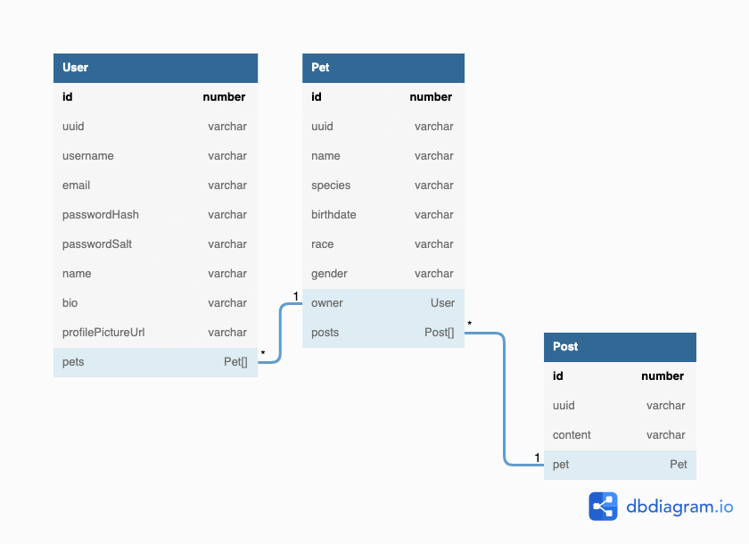

# PetBook

PetBook is a social media platform build aroud pets. This project is created as an learning project to learn more about backend development.
You can find a live version of the project under https://petbook.johanneskrabbe.com. The backend is deployed at https://petbook-api.johanneskrabbe.com.

## Setup this project locally

- clone both, the client and the server repo from GitHub (https://github.com/Johannes-Krabbe/petbook-client , https://github.com/Johannes-Krabbe/petbook-server)
- setup the frontend (you can find the instuctions in README.md in the client repo)
- create a postgres Database (https://www.postgresql.org/)
- create a .env file and set the variables provided in the .env.example
- run `yarn install`
- run `yarn dev`

## Documentation

### Architecture

This webapp is deployed with docker on Google Cloud Run (https://petbook.johanneskrabbe.com).
The Production database is is hosted on Google CloudSQL.

### Techstack

- NodeJS
- Typescript
- Express
- Postgres
- Typeorm

I chose the Techstack at the beginning of my learning jurney. My goal was to learn more about web-development, so it was convinient to use Typescript for both the backend and frontend, so I dont had to switch between languages.
I decided on a Relational database over an NoSQL database, because connections are a key feature of an SocialMedia platform. Typeorm seemed to be an good fit as an object-relational mapper, to parameterize querries and prevent SQL Injection.

### Database

There are three Tables in the Database: `User`, `Pet` and `Post`. The `User` table has an one to many relationship with the `Pet` Table. A user can own multiple pets but a pet can only have one owner. The `Pet` Table has an one to many relationship whit the `Post` table. A user selects a pet before creating a post, and every pet can have multipe posts. A post can just be created for one pet.

### Authentication

The requests that need Authentication are:

- `/user/getMe`
- `/pet/create`
- `/pet/createPost`
- `/pet/getMine`

These requests use the authMiddleware (/src/middleware/auth.ts) which checks if the request has a valid session cookie, validates it and adds the content of the jwt token, a userUuid, to the request.

In order for the user to create an account, (`/user/createUser`), first of all the system checks if the username and the Email are uniqe. After that the system uses the password service (/src/services/passwordService.ts) to hash the password and store it together with an salt in the Database.

When the user trys to login (`/user/login`), the system checks if a user with the given username exists. Then it checks the validity of the Password with the password service and finally creates an jwt Token and retruns it.
